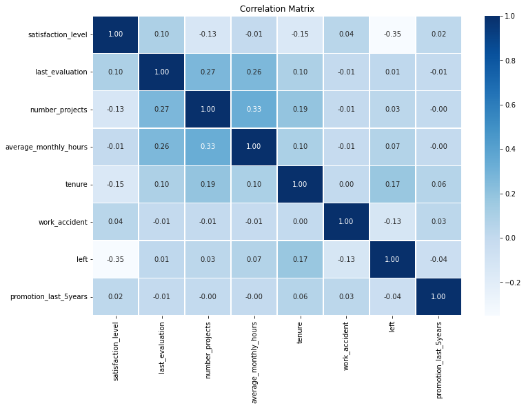
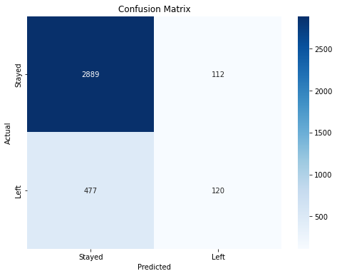
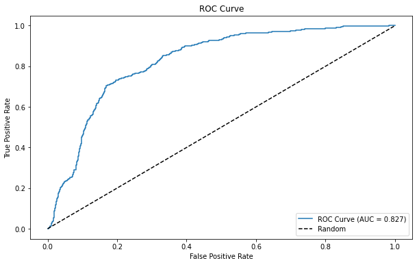

# Salifort Motors Employee Turnover Analysis 🔍

This repository contains a comprehensive analysis of factors driving employee turnover at Salifort Motors using multiple machine learning approaches. Our models identify key drivers of turnover to guide strategic HR initiatives and improve employee retention.

---

## Project Overview 📊

This analysis employs logistic regression and random forest models to identify and validate the key factors driving employee turnover at Salifort Motors. Using HR survey data from 14,999 employees, we provide data-driven insights to guide retention strategies and resource allocation.

---

## Key Findings 🔎

### Primary Drivers of Turnover

Our models identified different primary drivers of employee turnover:

- **Logistic Regression**: Demonstrated the strong correlation between satisfaction levels and turnover probability (strongest negative correlation at -0.35)

- **Random Forest**: Identified satisfaction level as the dominant factor, with number of projects and tenure as significant secondary predictors

### Feature Importance Comparison

The Random Forest feature importance rankings reveal a clear hierarchy of turnover factors:

### Key Turnover Factors Identified by Random Forest

The Random Forest analysis revealed a nuanced hierarchy of importance:

- **Satisfaction level** - overwhelmingly dominant predictor
- **Number of projects** - substantial secondary factor
- **Tenure** - important especially at mid-career stages (3-6 years)
- **Monthly working hours** - significant impact on turnover decisions
- **Last evaluation** - complex non-linear relationship with turnover

### Critical Experience Thresholds

Our analysis across models identified key turnover thresholds:

- Satisfaction ratings below 0.4 represent a critical risk zone
- Employees with 5+ projects show significantly higher turnover
- Monthly hours above 250 or below 150 correlate with higher departures
- Employees with 3-6 years tenure without promotion are at elevated risk

### Satisfaction-Evaluation Relationship

The scatter plot reveals distinct employee clusters at high risk of leaving:

---

## Models and Performance 📈

### Comprehensive Model Comparison

| Model | Accuracy | Precision | Recall | F1 Score | AUC |
|---------------------|----------|-----------|---------|----------|----------|
| Logistic Regression | 83.63% | 51.72% | 20.10% | 28.95% | 82.66% |
| Random Forest | 98.47% | 98.74% | 91.96% | 95.23% | 98.00% |

The performance metrics show that the Random Forest model substantially outperforms logistic regression, confirming the non-linear nature of turnover factors. The dramatic improvement in recall (20.10% vs. 91.96%) is particularly important for identifying employees at risk of leaving.

### Confusion Matrix Analysis

The confusion matrix shows that the logistic regression model struggled to identify employees who left (low recall), while the Random Forest model achieved excellent balance between precision and recall.

### ROC Curve Analysis

The significant difference in ROC-AUC scores (Logistic Regression: 0.827 vs. Random Forest: 0.980) further demonstrates the superior discriminative ability of the tree-based model.

### Department-Specific Performance

Our model shows varying effectiveness across departments:
- Sales department: Highest precision (73.33%)
- Support department: Strong precision (81.82%)
- R&D and Management departments: Lowest recall rates

---

## Strategic Recommendations 💡

Based on our comprehensive analysis, we recommend:

1. **Implement Workload Optimization**
   - Establish guidelines limiting employees to 3-4 concurrent projects
   - Create monitoring system for excessive working hours (>250 monthly)
   - Redistribute work from overloaded employees
   - Ensure meaningful work for underutilized employees

2. **Enhance Career Development Framework**
   - Address the critically low promotion rate (2.1% in 5 years)
   - Implement structured career pathing for employees reaching 2-3 year tenure
   - Create lateral movement opportunities when vertical promotion isn't possible
   - Establish regular career conversations for employees approaching the 3-year mark

3. **Revise Compensation Strategy**
   - Conduct market analysis to ensure competitive salaries, particularly at lower levels
   - Develop targeted retention bonuses for high-performing employees in high-risk categories
   - Implement salary review triggers based on tenure and performance combinations
   - Create non-monetary recognition programs to supplement financial incentives

4. **Deploy Predictive Analytics in HR Processes**
   - Implement the Random Forest model as an early warning system
   - Create an HR dashboard for ongoing monitoring of turnover predictors
   - Establish intervention protocols for employees flagged as high-risk
   - Train managers to recognize early warning signs of potential departures

5. **Develop Department-Specific Retention Initiatives**
   - Focus immediate efforts on sales, technical, and support departments
   - Create customized retention plans addressing unique departmental challenges
   - Assign retention champions within each high-risk department
   - Establish department-level turnover targets and incentives

---

## Repository Contents 📁

1. **Data Files**
   - [HR Dataset](HR_capstone_dataset.csv) (CSV)

2. **Python Scripts**
   - [HR Analytics EDA](predicting-employee-churn.py) (PY)
   - [Logistic Regression Model](predicting-employee-churn.py) (PY)
   - [Random Forest Analysis](predicting-employee-churn.py) (PY)

3. **Visualizations**
   - [Correlation Matrix](correlation-matrix.png) (PNG)
   - [Feature Importance](top-10-features-by-importance.png) (PNG)
   - [Confusion Matrix](confusion-matrix.png) (PNG)
   - [ROC Curve](roc-curve.png) (PNG)
   - [Satisfaction vs Evaluation](satisfaction-level-vs-last-evaluation.png) (PNG)
   - [Turnover by Department](turnover-rate-by-department.png) (PNG)
   - [Turnover by Salary](turnover-rate-by-salary-level.png) (PNG)
   - [Turnover by Promotion](turnover-rate-by-promotion-status.png) (PNG)

---

## Model Evolution 🧠

This project demonstrates a progression of increasingly sophisticated modeling approaches:

1. **Initial Data Exploration**: Thorough EDA revealed key patterns and relationships in the HR data.

2. **Logistic Regression**: Provided a baseline model with good interpretability but limited capacity for non-linear relationships.

3. **Random Forest**: Significantly improved performance by capturing non-linear patterns and feature interactions.

Each model contributed unique perspectives to our understanding of employee turnover dynamics, demonstrating the value of employing multiple modeling approaches.

---

## Future Work 🚀

Potential extensions of this analysis include:

- XGBoost implementation for potentially higher accuracy
- Neural network approaches for handling complex interaction effects
- Time-series analysis to track retention changes after HR initiatives
- Cluster analysis to identify distinct employee segments with different turnover drivers
- Deployment of a real-time turnover prediction system
- Bayesian modeling for quantifying uncertainty in predictions

---

## Contact Information ✉️

For inquiries about this analysis:

- [LinkedIn Profile](https://www.linkedin.com/in/melissaslawsky/)
- [Client Results](https://melissaslawsky.com/portfolio/)
- [Tableau Portfolio](https://public.tableau.com/app/profile/melissa.slawsky1925/vizzes)
- [Email](mailto:melissa@melissaslawsky.com)

---

© Melissa Slawsky 2025. All Rights Reserved.
